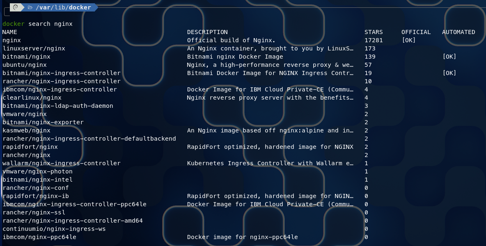
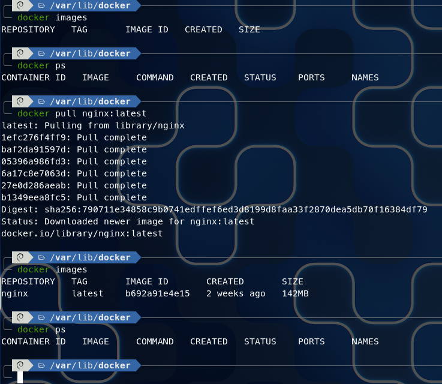
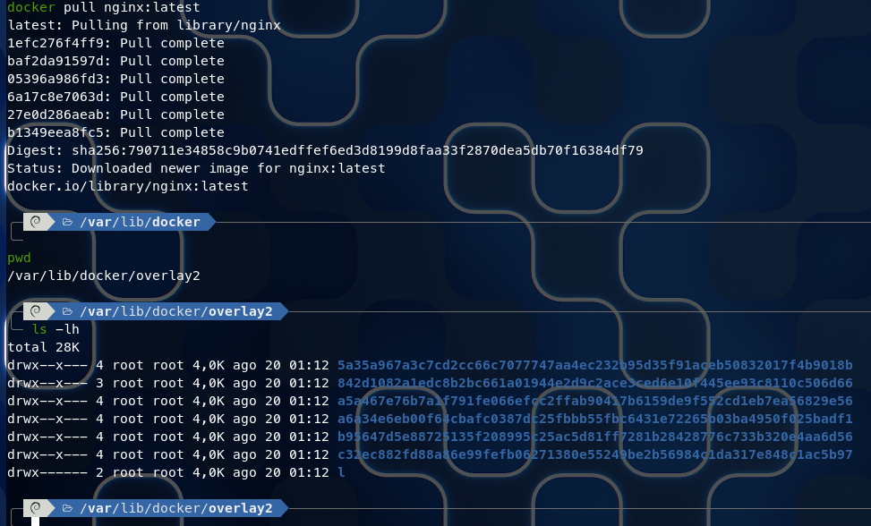
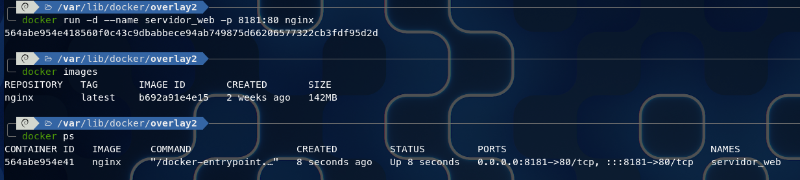
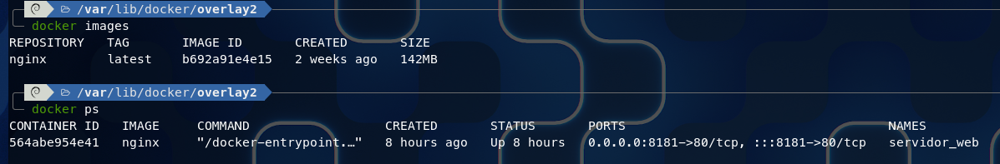
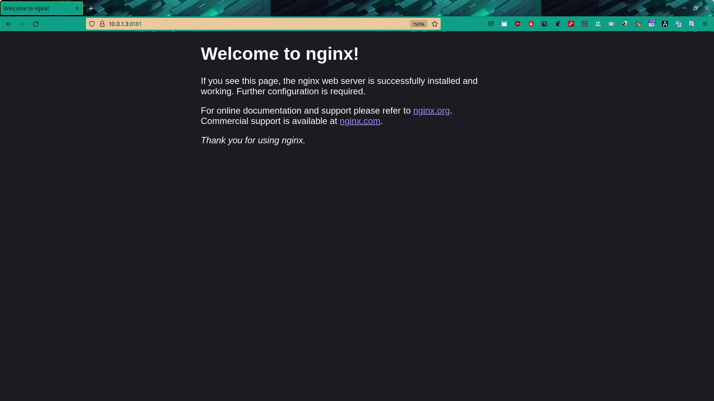
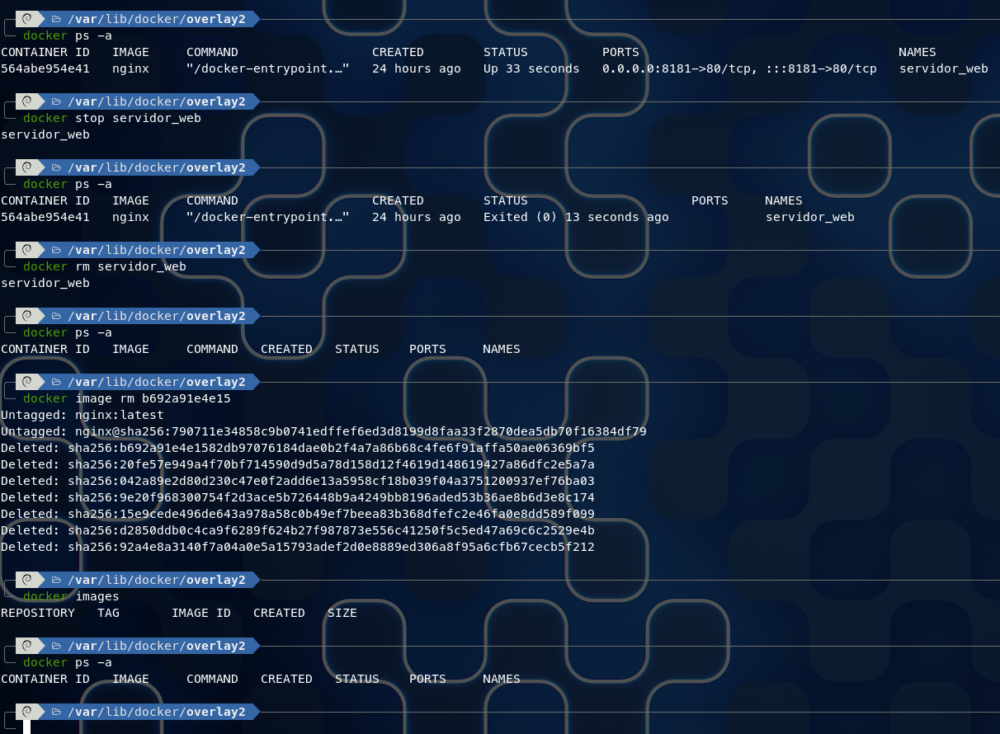

# RETO 1 - EJERCICIO 1


## Paso 1
Busqueda de la imagen docker en el repositorio




## Paso 2
Revisión del listado de las imagenes y contenedores en el equipo, luego se realiza la descarga de la imagen de NGINX al equipo, luego se vuelve a generar el listado de las imagenes disponibles




## Paso 3
Solo se hace una verifiación en el directorio oficial del equipo donde se observa la descarga realizada por docker en el directorio llamado

```
/var/lib/docker/overlay2
```




## Paso 4
Se hace la creación del contenedor para su ejecución, luego se realiza una verificación de imagenes y contenedores disponibles.
Además en la visualización de los contenedores se observa las especificaciones del contenedor por donde se puede localizar su servicio.




# Paso 5
Listado de disponibilidad de imágenes y contenedores




# Paso 6
Visualización de la ejecución del servidor web NGINX en el navegador, mostrando que esta recibiendo peticiones.




# Paso 7
Parada del contenedor y eliminación de èl, además también la eliminación de la imagen apenas se realiza la eliminación del contenedor.




