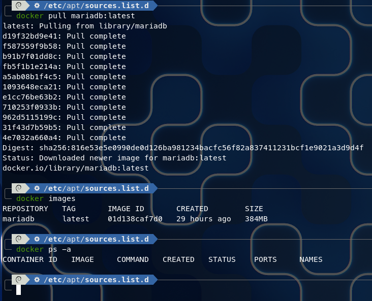
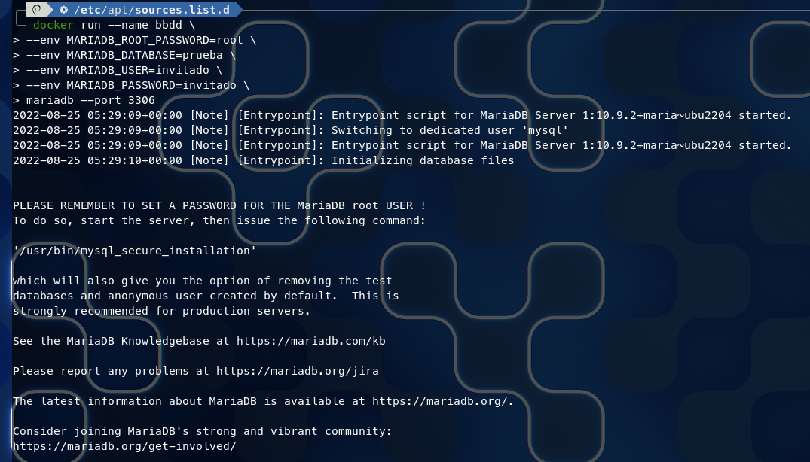
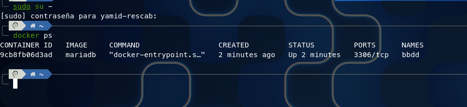
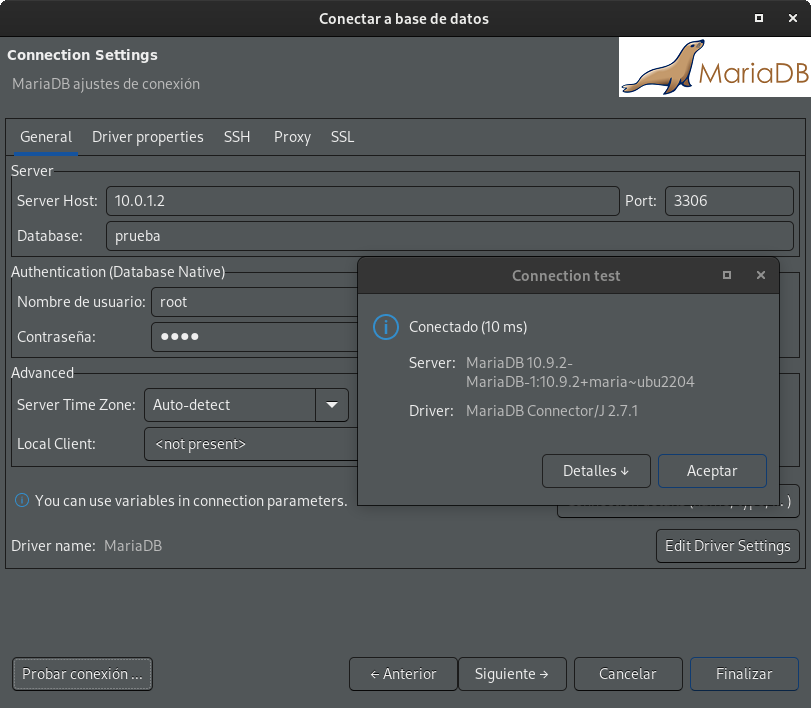
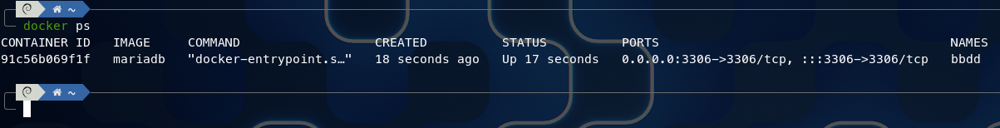
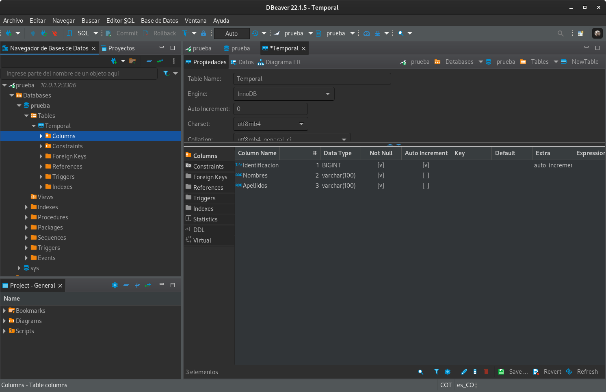
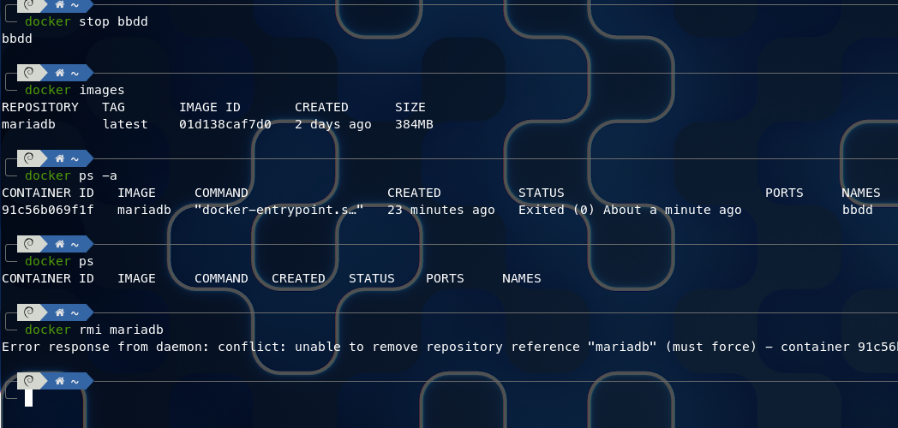

# RETO 2

- [RETO 1 - EJERCICIO 2](#reto-1---ejercicio-2)
  - [Creación de la imagen MariaDB](#creación-de-la-imagen-mariadb)
  - [Creación del contenedor MariaDB (error en la apertura del puerto)](#creación-del-contenedor-mariadb-error-en-la-apertura-del-puerto)
  - [Creación del contenedor MariaDB adecuadamente.](#creación-del-contenedor-mariadb-adecuadamente)
  - [Conectado con DBaver](#conectado-con-dbaver)
  - [Imposibilidad de eliminar imagen mientras el contenedor aun exista.](#imposibilidad-de-eliminar-imagen-mientras-el-contenedor-aun-exista)

## Creación de la imagen MariaDB

Se realiza la ejecución del comando **pull** de docker para realizar la extracción de la imagen de MariaDB a nuestro equipo y así poder trabajar con ella para realizar los contenedores \
necesarios.

```bash
docker pull mariadb:latest
```



## Creación del contenedor MariaDB (error en la apertura del puerto)

Esta fracción de código no genera un adecuada ejecución del docker debido al aislamento de puerto desde la parte externa hacia el docker, por lo cual no hay comunicación para accederlo

```bash
docker run --name bbdd \
--env MARIADB_ROOT_PASSWORD=root \
--env MARIADB_DATABASE=prueba \
--env MARIADB_USER=invitado \
--env MARIADB_PASSWORD=invitado \
mariadb --port 3306
```





## Creación del contenedor MariaDB adecuadamente.

Se realizan las correcciones para poder lanzar adecuadamente el contenedor.

```bash
docker run --name bbdd -p 3306:3306 \
--env MARIADB_ROOT_PASSWORD=root \
--env MARIADB_DATABASE=prueba \
--env MARIADB_USER=invitado \
--env MARIADB_PASSWORD=invitado \
mariadb
```





## Conectado con DBaver

Se realiza la conexión por medio del programa **DBeaver** para acceder a la base de datos llamada **Prueba** y allí se hacen algunas operaciones para modificar la base de datos.



## Imposibilidad de eliminar imagen mientras el contenedor aun exista.

Se realizar la verificación de poder borrar la imagen del docker mientras aun esta creado el contenedor que va relacionado a dicha imagen. Por consiguiente se puede observar que no es posible realizar dicha operación \
porque se debe eliminar cualquier dependencia con la imagen.

```bash
docker rmi mariadb
```


