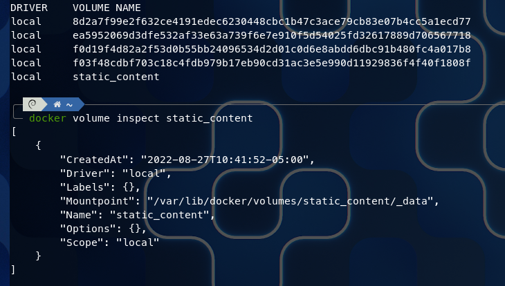
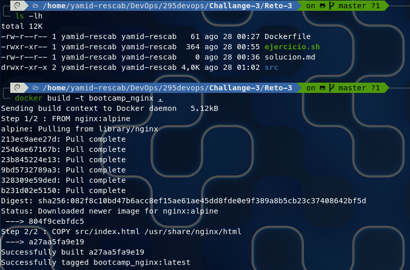
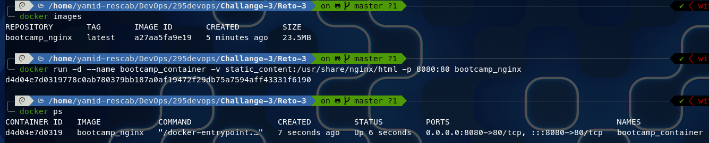
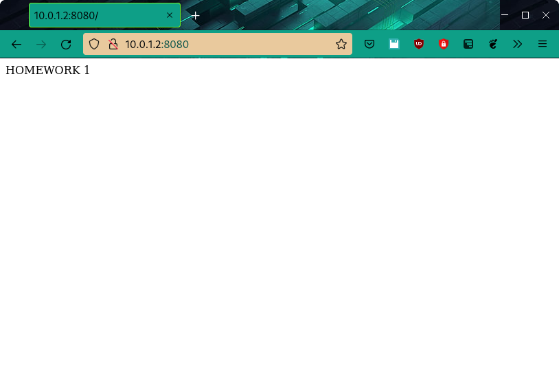
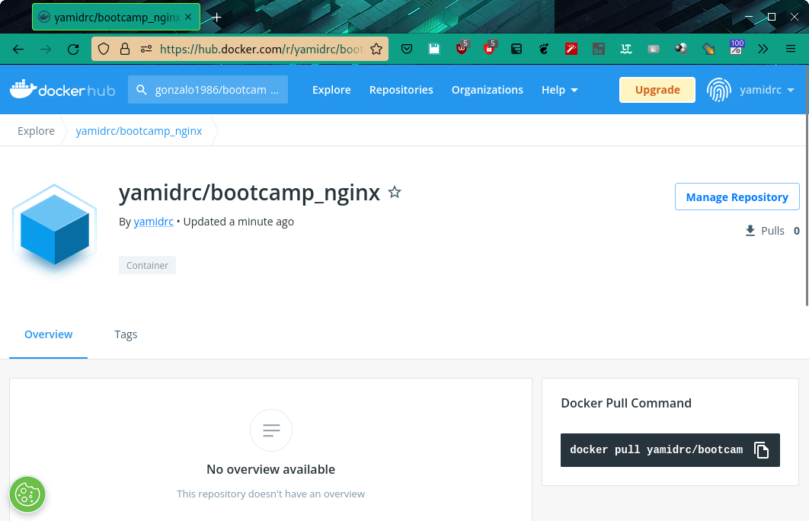

# RETO 3


## Creación de imagen personalizada de NGINX

Se realiza una personalización de una imagen para poder crear una imagen donde contendrá un archivo de tipo index.html \
personalizado y que será agregado dentro de la imagen.

``` bash
#!/bin/bash

# Creación de la imagen y ejecución del container
docker volume create static_content
docker build -t bootcamp_nginx .
docker run -d --name bootcamp_container -v static_content:/usr/share/nginx/html -p 8080:80 bootcamp_nginx
docker images
docker ps


# Registrar en DockerHub
docker tag bootcamp_nginx yamidrc/bootcamp_nginx:v1.0.0
docker push yamidrc/bootcamp_nginx:v1.0.0

```

### Creación del volumen


### Creación de la imagen
)

### Creación del contenedor
)

### Verificación del contenedor de NGINX que este respondiendo en el navegador
)

### Verificación que la imagen ha subido a DockerHub
)
