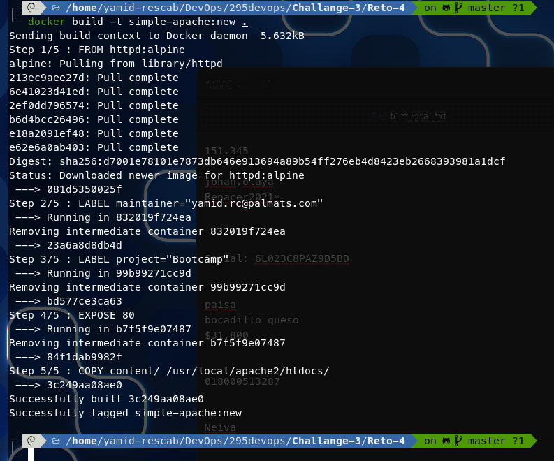
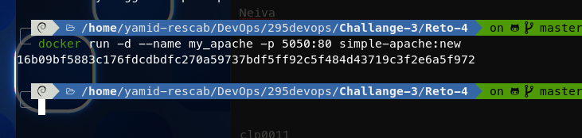
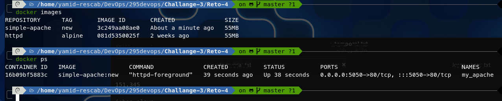
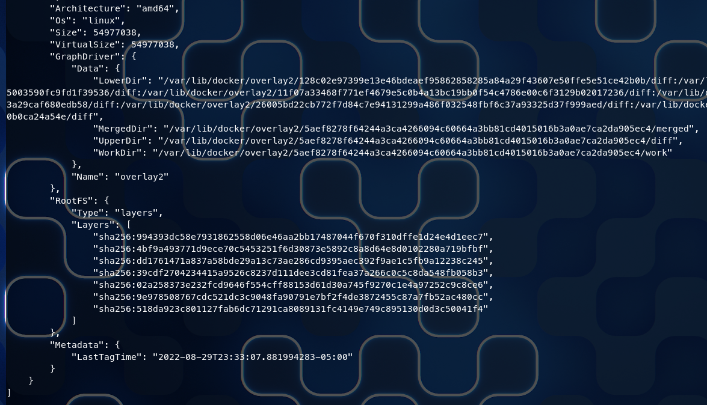
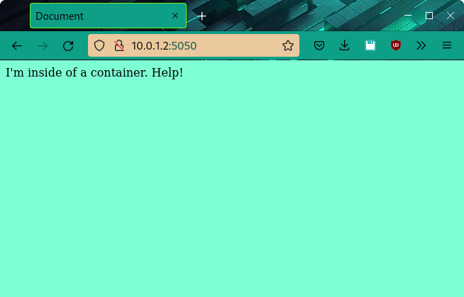

# RETO 4


## Creación de imagen personalizada de Apache

Se realiza una imagen personalizada para poder crear una imagen donde contendrá un archivo de tipo index.html y site.css \
personalizado y que será agregado dentro de la imagen.

``` bash
#!/bin/bash

# Creación de la imagen y ejecución del container
docker build -t simple-apache:new .
docker run -d --name my_apache -p 5050:80 simple-apache:new

# Visualización de las imágenes y contenedores
docker images
docker ps

# Para inspeccionar la imagen y poder verificar las capas que tiene la imagen
docker inspect simple-apache:new

```

### Creación de la imagen
)

### Creación del contenedor
)

### Verificación de imágenes y contenedores creados
)

### Revisión de número de capas generadas por la imagén.
Podemos observar que la imagén ha generado 7 capas \
)

### Verificaciòn en el navegador que el contenedor este respondiendo
Se observa que el servidor web Apache esta ejecutando con el archivo \
pesonalizado al momento de invocarlo. \
)