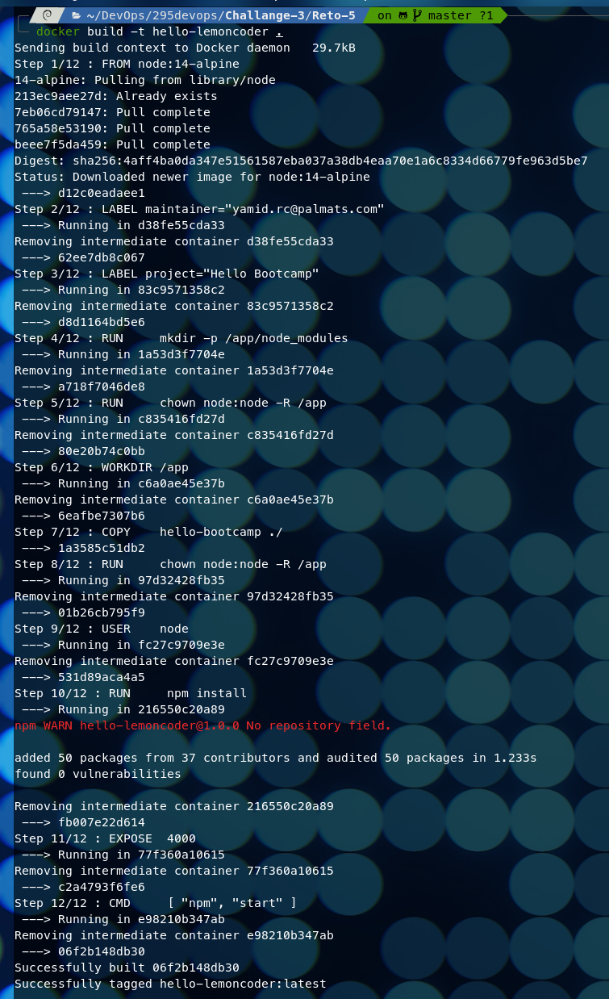
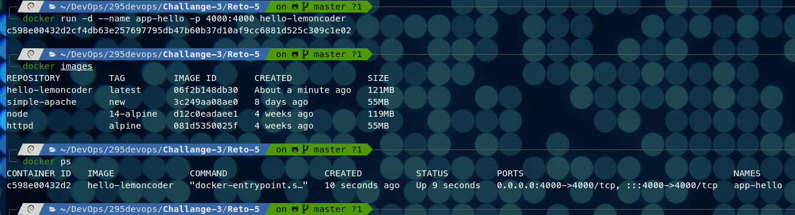
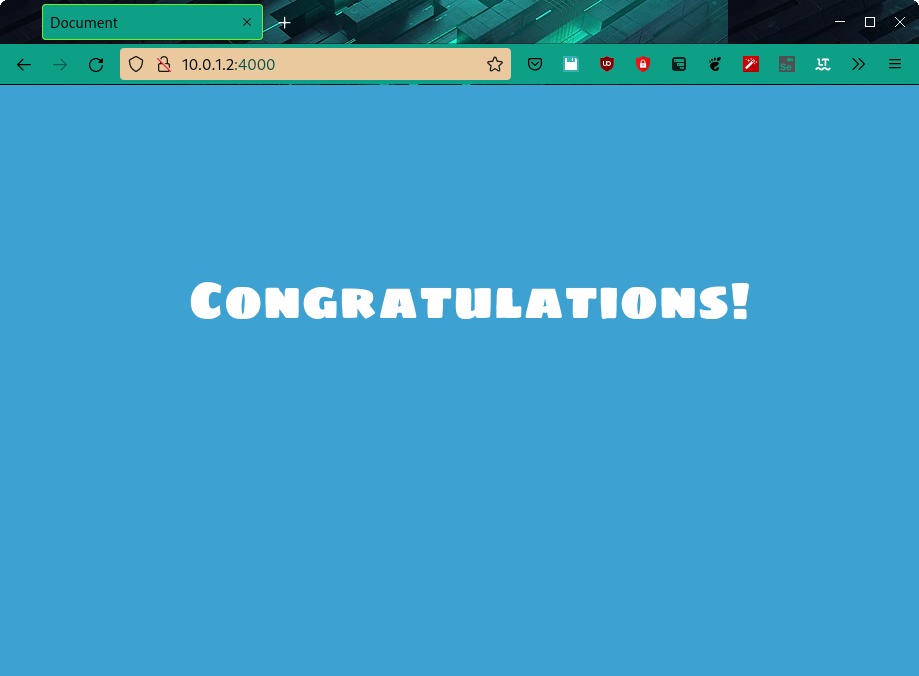
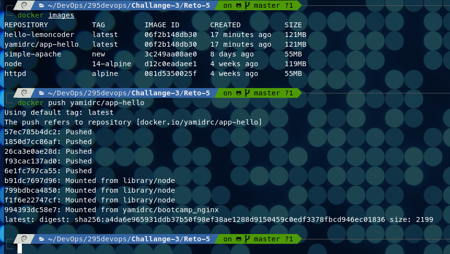
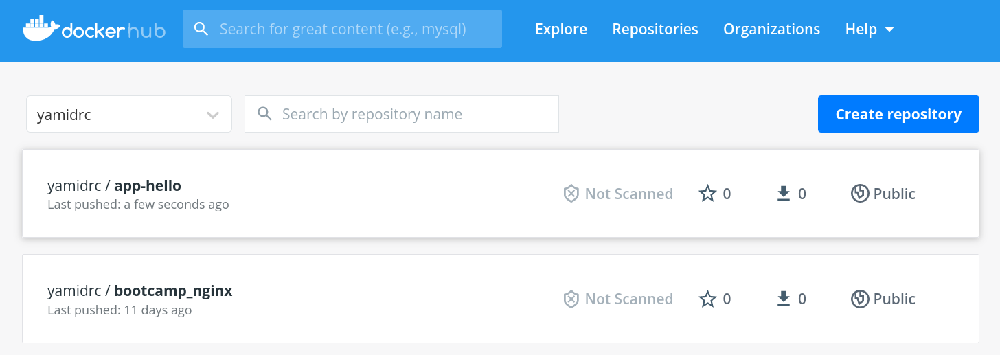

# RETO 5


## Containerizar aplicacion Node.js

Se realiza una personalización de una imagen docker basada desde una imagen base de NodeJS \
que permitirá ejecutar una aplicación hecha para este framework

### Archivo Dockerfile

```Dockerfile
# Imágen base para trabajar
FROM node:14-alpine

# Etiquetado
LABEL maintainer="yamid.rc@palmats.com"
LABEL project="Hello Bootcamp"

# Manejo de la aplicación personalizada
RUN     mkdir -p /app/node_modules
RUN     chown node:node -R /app
WORKDIR /app
COPY    hello-bootcamp ./
RUN     chown node:node -R /app
USER    node
RUN     npm install
EXPOSE  4000
CMD     [ "npm", "start" ]
```

### Script Bash

``` bash
##!/bin/bash

# Crear imagen para docker
docker build -t hello-lemoncoder .
docker run -d --name app-hello -p 4000:4000 hello-lemoncoder
docker images
docker ps

# Subirlo a Register
docker tag hello-lemoncoder yamidrc/app-hello
docker push yamidrc/app-hello
```

### Creación de la imagen
)

### Creación del contenedor y verificación de imagen y ejecución del contenedor
)

### Verificación que el servición este activo por medio del navegador web
)

### Registrar la imagen en DockerHub
)

### Verificación que la imagen esta disponible en DockerHub
)